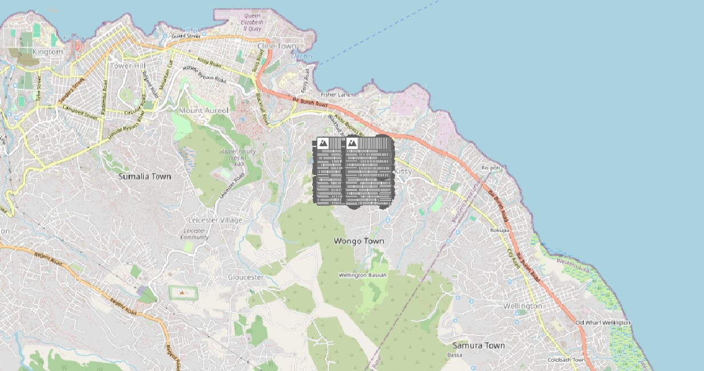
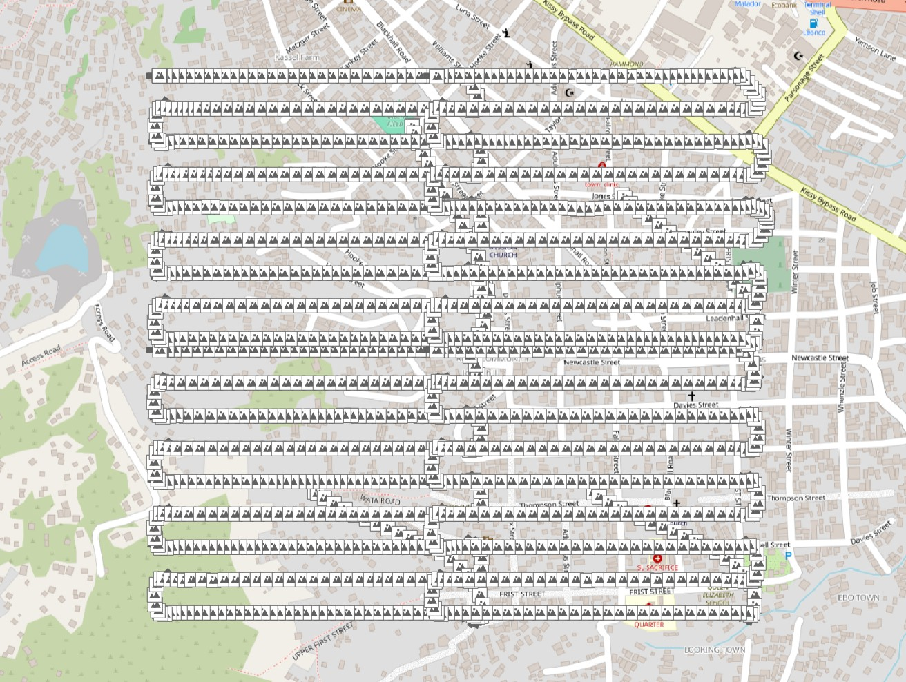
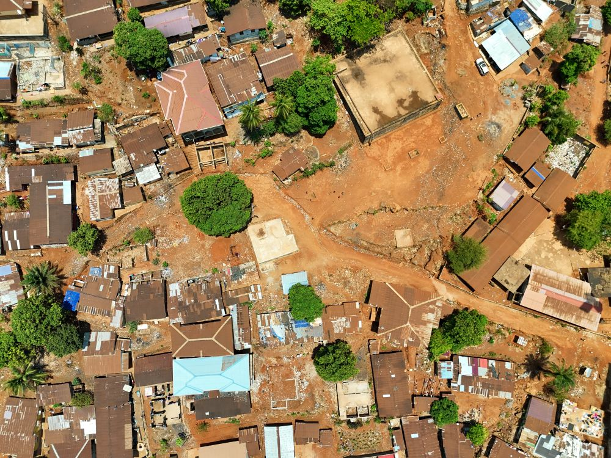

# Drone Test Data Freetown (Sani Abacha to Wellington)





View the AOI on a map [here](./aoi.geojson).

## Contents

- Images of Freetown, Sierra Leone.
  - Images are from adjacent tasks, allowing for processing in ODM.
  - As they are too large to store in Git, a link to S3 is provided instead.
- A GeoJSON AOI of the area.
- QGIS project to load and visually inspect.
- Images geopackage, to display inside QGIS easily.
- Image metadata CSV extracted via `exiftool`.

View the AOI on a map [here](./aoi.geojson).

## Imagery Source

DroneTM project:
- `images/task-29`: https://dronetm.org/projects/263e1c16-7fa8-475c-8b19-f059968d4817/tasks/88bccae3-7271-42a1-8c9c-7825dac50131
- `images/task-28`: https://dronetm.org/projects/263e1c16-7fa8-475c-8b19-f059968d4817/tasks/872fa25c-938a-424f-aab3-8ead09f5cd0f
- `images/task-36`: https://dronetm.org/projects/263e1c16-7fa8-475c-8b19-f059968d4817/tasks/5a7cc6cc-2ea6-4e06-aa2a-9b7a8fe6094f
- `images/task-35`: https://dronetm.org/projects/263e1c16-7fa8-475c-8b19-f059968d4817/tasks/243acb02-65e7-4cf2-a6b3-29416bf68596

## Flight Tails

- Freetown was the first city-scale project collected with DroneTM.
- As part of working things out, we noticed that operators started taking
  imagery from when the drone took off, to when the drone landed.
- This resulted in many redundant images, but also large 'flight tails',
  where the drone was navigating to and from the waypoint mission.
- These flight tails messed with the processing in ODM, so we decided
  to implement logic to identify and remove them automatically.
- This dataset is primarily for testing the removal functionality.

## Simulating Flight Gaps

- The imagery in this dataset is complete.
- However, for testing to identify gaps in the flight (i.e. missed
  areas that imagery did not cover), running the following script
  will delete some chunks for the imagery:
- The resulting coverage will contain gaps.

```bash
# Warning! This will delete photos from the downloaded imagery.
# To recover them, simply run the rclone command again.

bash generate-flight-gaps.sh
```

## Example Image



All imagery is licensed as CC-BY-4.0.

### Uploading To S3

```bash
docker run --rm -it --entrypoint=sh -v "/home/YOURUSER/rclone.conf:/config/rclone/rclone.conf" -v "$(pwd)/images:/images" rclone/rclone:latest

rclone sync --verbose /images dronetm-testdata:dronetm-testdata/freetown-1
```

### Downloading From S3

```bash
docker run --rm -it --entrypoint=sh -v "/home/YOURUSER/rclone.conf:/config/rclone/rclone.conf" -v "$(pwd)/images:/images" rclone/rclone:latest

rclone sync --verbose dronetm-testdata:dronetm-testdata/freetown-1 /images
```
